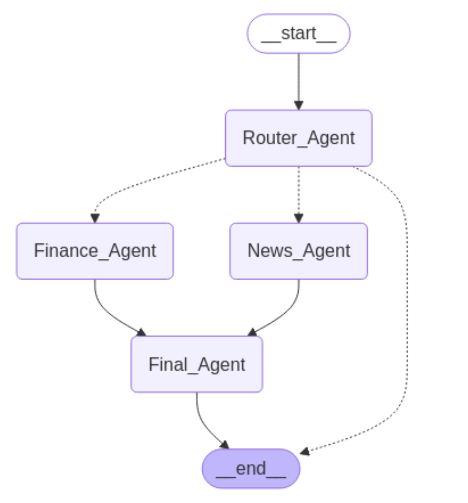

# Stock Analyst - Multi Agents System

## Overview

This repository contains a stateful AI agents system designed for financial  stock analysis and news retrieval using LangGraph and LangChain. It integrates document processing, vector storage, and financial data retrieval, leveraging Yahoo Finance and OpenAI's Azure ChatGPT models to provide insightful financial analysis and the latest news about stock market trends.

### Graph structure

#### Features

1. Financial Data Retrieval: Uses yfinance to fetch key financial metrics such as income statements, balance sheets, cash flow data, and financial ratios.
2. News Retrieval: Fetches the latest financial news using Yahoo Finance and processes them for retrieval-based question answering.
3. Vector Store for Semantic Search: Utilizes document chunking and vector storage to efficiently retrieve relevant financial information.
4. Stateful AI Agent: Built with LangGraph to maintain conversation state and route user queries to appropriate modules.
5. Azure OpenAI Integration: Uses Azure ChatGPT (gpt-4o-mini) for intelligent query processing and routing.

#### Repository Structure

1. main.py: The core script implementing the AI agents using LangGraph. It handles query processing, document retrieval, and financial analysis workflows.

2. finance_tool.py: A module for retrieving financial data from Yahoo Finance, including income statements, balance sheets, and cash flow data.

3. rag_tool.py: Implements a retrieval-augmented generation (RAG) pipeline for extracting relevant news articles and performing semantic search.