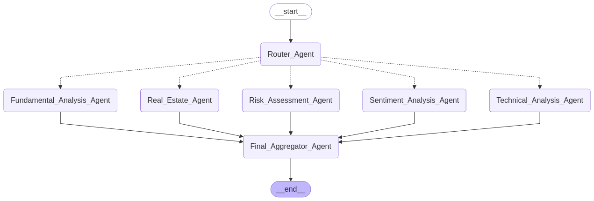

# Stock Analyst - Multi Agents System

## Overview

This repository contains a modular, **multi-agent AI system** for performing comprehensive financial and stock analysis, built using **LangGraph** and **LangChain**. The system is designed to handle real-world investor queries by orchestrating specialized AI agents that analyze fundamental data, technical trends, sentiment signals, market risk, and real estate conditions. It integrates document processing, financial data APIs, real-time web search, and vector storage to produce context-rich, data-driven answers.

### Graph structure

### 🔁 Architecture Overview

The system follows a **graph-based multi-agent architecture** where a central **Router Agent** intelligently delegates user queries to specialized agents. A final **Aggregator Agent** synthesizes the outputs and produces a complete, human-readable response.

Agents include:
- 📘 Fundamental Analysis Agent
- 📈 Technical Analysis Agent
- 💬 Sentiment Analysis Agent
- ⚠️ Risk Assessment Agent
- 🏘️ Real Estate Agent

### 🚀 Features

- **🧾 Financial Data Retrieval (yfinance)**  
  Automatically fetches and analyzes key financial metrics: income statements, balance sheets, cash flow reports, and financial ratios.

- **📰 News-Based Sentiment Analysis (RAG)**  
  Retrieves financial news using yfinance and processes it using a **sentence transformer embedding model** (`BAAI/bge-small-en-v1.5`) and **ChromaDB** for vector search. Enables semantic search and context-aware sentiment insights.

- **🌍 Real Estate Data Integration (SCB)**  
  Uses the `pyscbwrapper` library to pull housing price index data from **Statistics Sweden (SCB)**, supporting geographically specific real estate evaluations.

- **🌐 Web Search Tool (Tavily)**  
  Enables real-time financial trend updates and sentiment tracking via API-based web search.

- **🧠 LangGraph + Azure OpenAI Integration**  
  Built on **LangGraph** with `create_react_agent`, supporting memory, tool-calling, and stateful reasoning. Uses **Azure-hosted GPT-4o-mini** for intelligent, multi-turn query understanding and planning.

