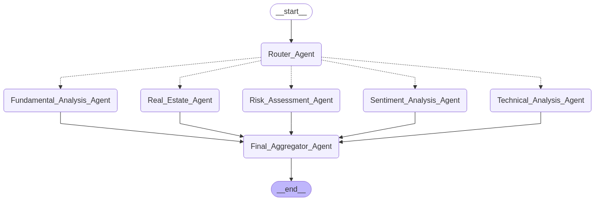

# Stock Analyst — Multi-Agent System

[](https://github.com/Magesh-Babu/Multi_Agents_System_Langgraph/actions/workflows/ci.yml)

A full-stack AI system that answers financial and real estate queries using a graph-based multi-agent architecture. A **Router Agent** analyses the user's question, delegates to the right specialist agents in parallel, and a **Final Aggregator** synthesises everything into one clear response — all visible in real time through a React/Next.js UI.

---

## Architecture



---

## Tech Stack

| Layer | Technology |
|---|---|
| Agent orchestration | LangGraph, LangChain |
| LLM | Azure OpenAI GPT-4o |
| Financial data | yfinance, Tavily Search |
| News RAG pipeline | ChromaDB, sentence-transformers (BAAI/bge-small-en-v1.5) |
| Real estate data | Statistics Sweden API (pyscbwrapper) |
| Backend API | FastAPI, Server-Sent Events (SSE) |
| Frontend | Next.js (Pages Router), React |
| Testing | pytest, pytest-mock (32 tests) |
| Containerisation | Docker, docker-compose |
| CI | GitHub Actions |

---

## Project Structure

```
stock_analyst/          ← core Python package
├── config/settings.py  ← env vars + tunable params (pydantic-settings)
├── graph/              ← LangGraph state, nodes, builder
├── agents/prompts.py   ← all system prompts as named constants
├── tools/              ← 8 LangChain tools (financial, technical, RAG, real estate)
└── utils/              ← yfinance wrapper, RAG utilities

api/                    ← FastAPI backend
├── main.py             ← /health, /analyze, /analyze/stream endpoints
├── schemas.py          ← Pydantic request/response models
└── dependencies.py     ← compiled graph cached via lru_cache

frontend/               ← Next.js UI
├── pages/index.js      ← main page — state management + SSE client
├── components/         ← AgentPipeline (live status), ChatPanel
└── lib/stream.js       ← SSE stream handler

tests/                  ← pytest suite (32 tests, all mocked)
notebooks/demo.ipynb    ← original notebook with real agent output examples
```

---

## Quickstart

### Prerequisites
- Python 3.10+
- Node.js 20+
- Azure OpenAI API key and endpoint
- Tavily API key ([free tier](https://tavily.com))

### 1. Clone and install Python dependencies

```bash
git clone https://github.com/Magesh-Babu/Multi_Agents_System_Langgraph.git
cd Multi_Agents_System_Langgraph
pip install -r requirements.txt
```

### 2. Set up environment variables

```bash
cp .env.example .env
# Edit .env and fill in your credentials
```

```env
AZURE_GPT_API=your_azure_openai_api_key
AZURE_GPT_ENDPOINT=https://your-resource.openai.azure.com/
TAVILY_API_KEY=your_tavily_api_key
COOKIE_YAHOO=your_yahoo_finance_cookie   # optional — needed for news sentiment
```

### 3. Start the FastAPI backend

```bash
uvicorn api.main:app --reload
# API running at http://localhost:8000
# Swagger UI at http://localhost:8000/docs
```

### 4. Start the Next.js frontend

```bash
cd frontend
npm install
npm run dev
# UI running at http://localhost:3000
```

---

## API Endpoints

| Method | Endpoint | Description |
|---|---|---|
| `GET` | `/health` | Liveness check |
| `POST` | `/analyze` | Blocking — returns full answer + agents used |
| `POST` | `/analyze/stream` | SSE stream — emits per-agent events in real time |

### Example request

```bash
curl -X POST http://localhost:8000/analyze \
  -H "Content-Type: application/json" \
  -d '{"query": "Is NVDA a good buy based on technicals?", "thread_id": "1"}'
```

### SSE stream event format

```json
{"type": "agent_start",  "agent": "Router_Agent"}
{"type": "agent_done",   "agent": "Technical_Analysis_Agent", "content": "..."}
{"type": "final_answer", "agent": "Final_Aggregator_Agent",   "content": "..."}
{"type": "done"}
```

---

## Run with Docker

```bash
cp .env.example .env   # fill in credentials
docker-compose up --build
# API at http://localhost:8000
```

---

## Run Tests

```bash
pytest tests/ -v
```

All 32 tests run without real API keys — external services are mocked.

---

## Example Queries

| Query | Agents involved |
|---|---|
| `"Analyse TSLA balance sheet"` | Fundamental |
| `"Is NVDA overbought technically?"` | Technical |
| `"What is the market sentiment for MSFT?"` | Sentiment |
| `"What are the risks in investing in AAPL?"` | Risk Assessment |
| `"Is it a good time to buy a house in Stockholm?"` | Real Estate |
| `"TSLA fundamentals and market sentiment"` | Fundamental + Sentiment |

See [notebooks/demo.ipynb](notebooks/demo.ipynb) for full example outputs from each agent.

---

## Configuration

All parameters are configurable via environment variables or `.env`:

| Variable | Default | Description |
|---|---|---|
| `DEPLOYMENT_NAME` | `gpt-4o` | Azure OpenAI deployment name |
| `TEMPERATURE` | `0.2` | LLM temperature |
| `CHUNK_SIZE` | `1000` | RAG document chunk size |
| `CHUNK_OVERLAP` | `200` | RAG chunk overlap |
| `RETRIEVAL_K` | `2` | Number of RAG documents retrieved |
| `CHROMA_DB_PATH` | `./chroma_db` | Vector store persistence path |
